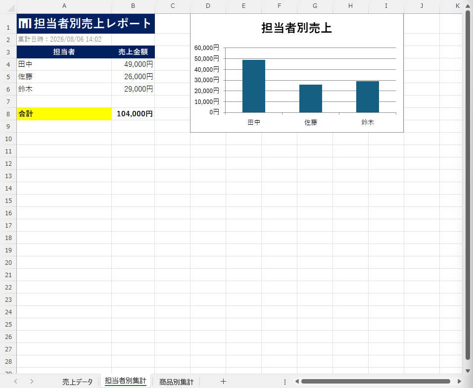
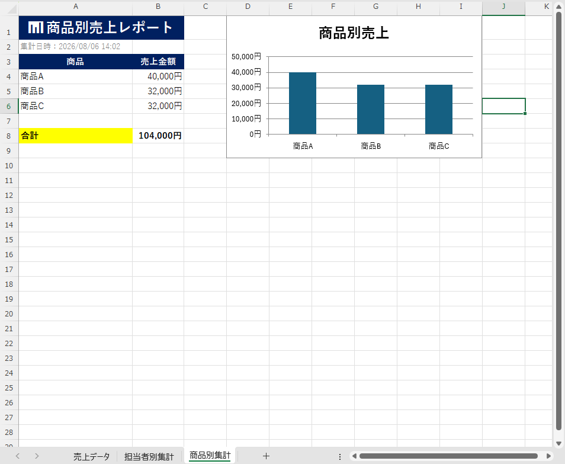
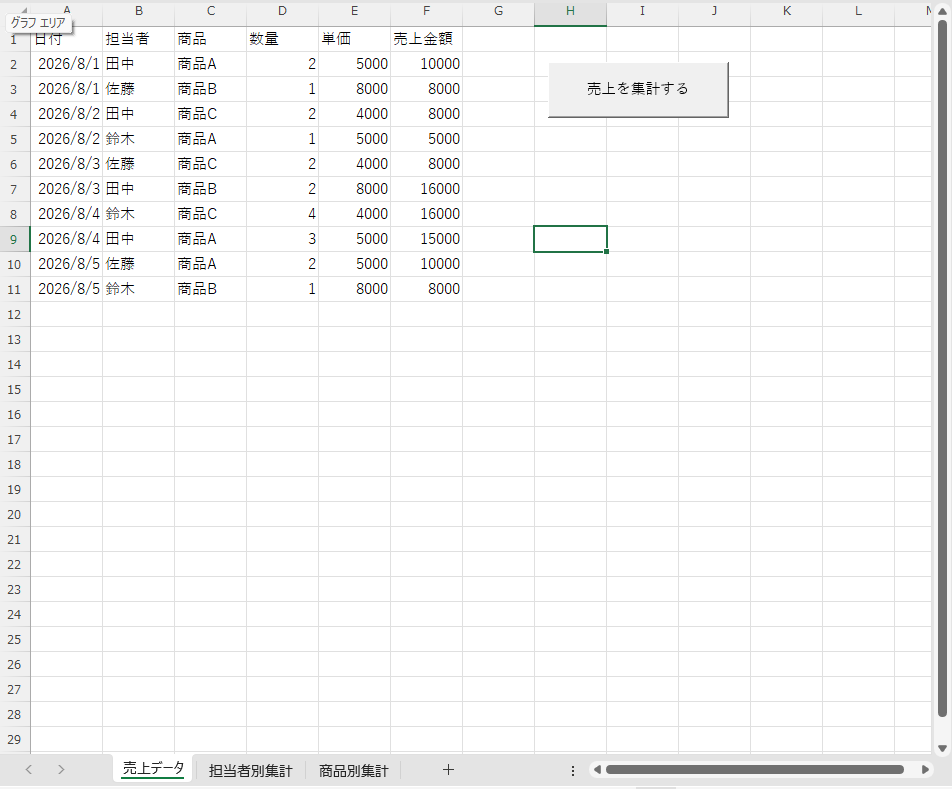

# 📊 Excel Sales Report Automation Tool

Excel VBAを使用して作成した、売上集計を自動化するツールです。

ボタンを1回押すだけで担当者別・商品別の売上を集計し、グラフまで自動で作成します。

---

# ✨ 主な機能

- 担当者別売上集計
- 商品別売上集計
- 売上金額自動計算
- 合計金額表示
- グラフ自動生成
- 集計日時表示
- 入力チェック
- エラー処理

---

# 🛠 使用技術

- Microsoft Excel
- VBA (Visual Basic for Applications)

---

## 📷 スクリーンショット

### 担当者別売上

### 商品別売上

### 売上データ

---

# 🚀 今後追加予定

- PDF出力
- 印刷レイアウト
- ダッシュボード
- 月別集計
- CSV取込

---

Complete version 1.0

Created by **KT Automation**
